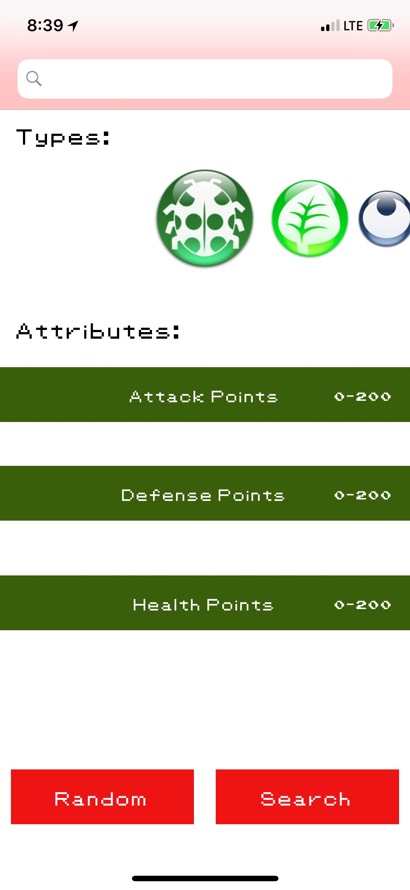
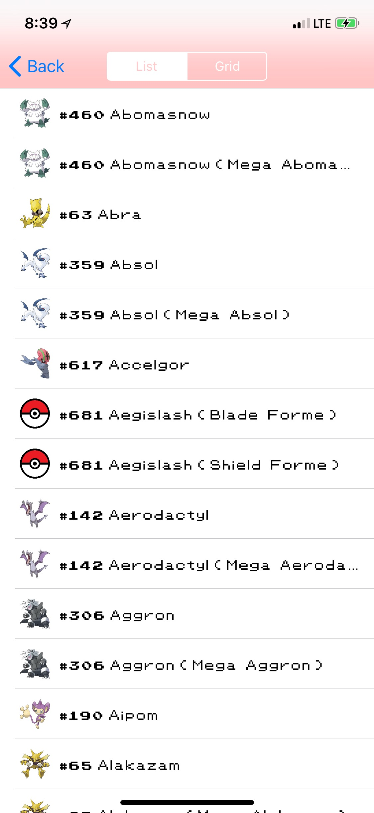
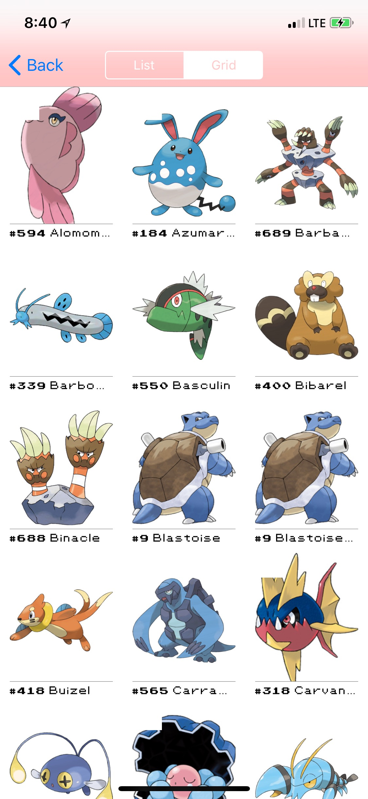
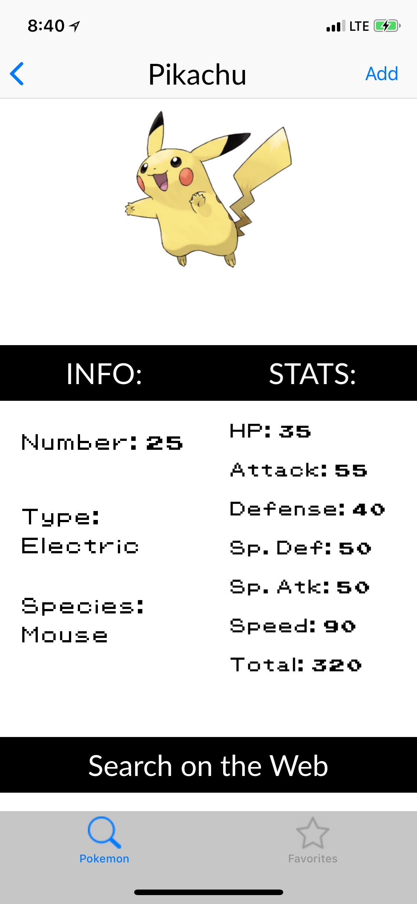

# Pokedex
MDB Mini Project 2

# Screen 1:
This is the start screen where users can search for specific pokemon by name or number or generate a list of pokemon based on their search. In addition, users can specify which types of pokemon they would like to include in their search and set the minimum health, attack, and defense points for pokemon in their search.

# Screen 2:
A segmented control that shows both a list view and collection view of the pokemon from the previous search.

# Screen 3:
A tab bar view where users can see specific statistics for a Pokemon as well as add the Pokemon to a list of favorites.

